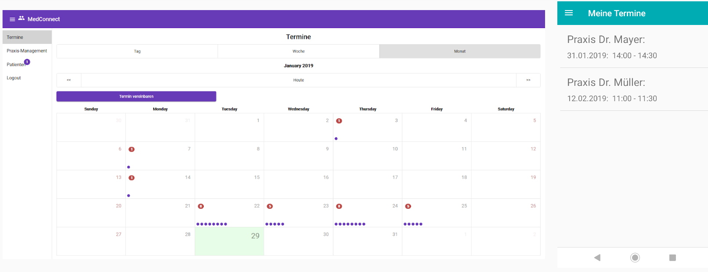
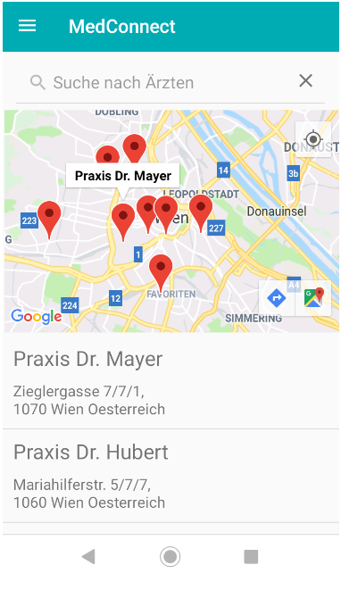
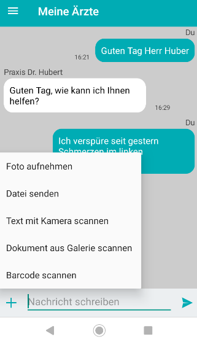

# connectTUdoc
connectTUdoc is a university project which aims to simplify communication between doctors and patients.
It enables appointment management, encrypted text & video chat, file transfer and medication recognition using ML Kit.

  
   
   

## Implementation 
### Technology
#### Web Frontend
* Angular 7.1
* Angular Material 7.1
* Angular Firebase
* WebRTC
#### Mobile Frontend
* Android 9
* Kotlin 1.3
* Google's ML Kit
* Firebase
* WebRTC
#### Backend
* Spring Boot 2.1
* Java 11 (OpenJDK)
#### Database
* PostgreSQL 11
#### Deployment
* Docker 18.09
#### Cloud
* Firebase
* Virgil Security

### Basic structure
* web = Folder for web project
* mobile = Folder for android app project
* backend = Folder for spring boot backend
* docker-compose.yml = File for docker container orchestration (+db)
